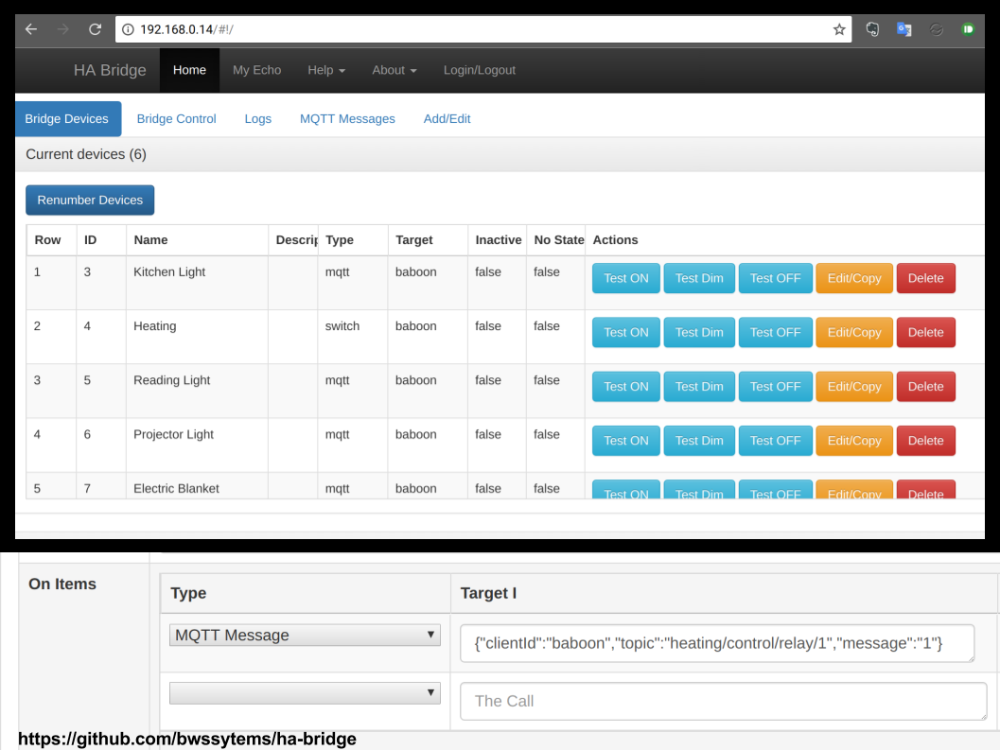
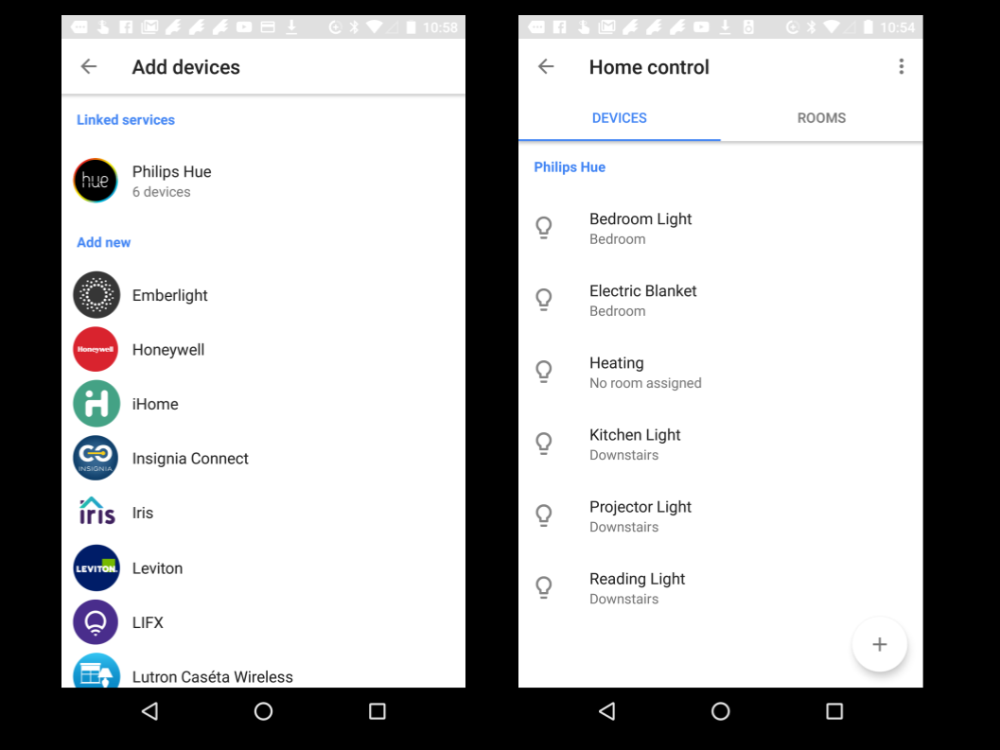

Here are install instructions to run [ha-bridge](https://github.com/bwssytems/ha-bridge) on an emonPi (Raspberry Pi running [emonSD](https://github.com/openenergymonitor/emonpi/wiki/emonSD-pre-built-SD-card-Download-&-Change-Log) based on Raspbian Jessie).

Home automation (HA) bridge emulates a Philips Hue light system and can control other systems such as a Vera, Harmony Hub, Nest, MiLight bulbs or any other system that has an http/https/tcp/udp interface.

Using ha-bridge Google Home or Amazon Echo can be used to control MQTT devices via voice. E.g [WiFi MQTT Relay](https://guide.openenergymonitor.org/integrations/mqtt-relay/), [LightWave RF plugs](https://guide.openenergymonitor.org/integrations/lightwaverf) or Sonoff plugs (with MQTT FW).

The install instructions below are mostly coped from [ha-bridge repo readme](https://github.com/bwssytems/ha-bridge) with a few changes to work on the emonPi with it's read-only root file-system.

# Video Demo

[Google Home Controlling MQTT Video Demo](https://www.youtube.com/watch?v=r_v4GXVp0OI)

# Install ha-bridge on emonPi

*Tested on [emonSD-07Nov16](https://github.com/openenergymonitor/emonpi/wiki/emonSD-pre-built-SD-card-Download-&-Change-Log#emonsd-07nov16)*

The emonPi runs a read-only file-system. The only folder which is mounted as RW is `/home/pi/data/`, we need to move ha-bridge config to this folder to allow ha-bridge to be able to save it's db and config when emonPi is in RO mode:

```
rpi-rw
cd home/pi/data
mkdir habridge
wget https://github.com/bwssytems/ha-bridge/releases/download/v4.5.0/ha-bridge-4.5.0.jar
```

Replace the above URL with latest version

## Run for the first time

Since ha-bridge by default runs on port 80 we need to stop apache (serving emoncms) temporarily to allow us to run ha-bridge for the first time:

`sudo service apache2 stop`

Test run the ha-bridge

`sudo java -jar ha-bridge-4.5.0.jar`

Note you can also select which port to start the ha-bridge by using the command line option:
### -Dserver.port=`<port number>`
eg:
```
java -jar -Dserver.port=8081 ha-bridge-W.X.Y.jar
```

## Make ha-bridge run alongside Apache

Browse to the GUI web page and edit the port (under Bridge Control) to run on a different port, lets go for 8081 (since OpenHAB is running on 8080). Save the config

[http://emonpi/#!/system](http://emonpi/#!/system)

Now return to SSH terminal and stop java process (CTRL + C) then open port 8081

`sudo ufw allow 8081/tcp`

Now start ha-bridge java process and browser to port 8081

[http://emonpi:8081](http://emonpi:8081)

You should now be able to see ha-bridge web page..great! Now stop ha-bridge again (CTRL+C)


# Enable the required Apache modules:

`a2enmod proxy proxy_http headers`

We now need to make ha-bridge run nicely alongside Apache (which is already using port 80). Edit apache config to create a reverse proxy to allow ha-bridge to run alongside apache on port 80. All `/api` calls will be passed to ha-config

`sudo nano /etc/apache2/sites-enabled/000-default.conf`

At the following lines below `<VirtualHost *:80>`

```
ProxyPass         /api  http://localhost:8081/api nocanon
        ProxyPassReverse  /api  http://localhost:8081/api
        ProxyRequests     Off
        AllowEncodedSlashes NoDecode

        # Local reverse proxy authorization override
        # Most unix distribution deny proxy by default (ie /etc/apache2/mods-enabled/proxy.conf in Ubuntu)
        <Proxy http://localhost:8081/api*>
                  Order deny,allow
                  Allow from all
        </Proxy>
```

Save and exit nano then start Apache:

`sudo service apache2 start`

Now the ha-bridge API should be able to run alongside Apache on port 80. Google Home requires ha-bridge to be on port 80.


## Run ha-bridge as a sysem service

Start here to create the habridge.service unit file:
```
cd /etc/systemd/system
sudo nano habridge.service
```
Copy the text below into the editor nano, note the custom emonPi RW location for the config file.

```
[Unit]
Description=HA Bridge
Wants=network.target
After=network.target

[Service]
Type=simple
WorkingDirectory=/home/pi/data/habridge
ExecStart=/usr/bin/java -jar -Dconfig.file=/home/pi/data/habridge/data/habridge.config /home/pi/data/habridge/ha-bridge-4.5.0.jar

[Install]
WantedBy=multi-user.target
```
Save the file in the editor by hitting CTL-X and then saying Y to update and save.

Reload the system control config:
```
sudo systemctl daemon-reload
```
To start the bridge:
```
sudo systemctl start habridge.service
```
To start the service at boot, use the `enable` command:
```
sudo systemctl enable habridge.service
```
To look at the log, the output goes into the system log at `/var/log/syslog':
```
tail -f /var/log/syslog
```

## Connect ha-bridge to emonPi MQTT server

Load the ha-bridge web interface (http://emonpi:8081) and navigate to `Bridge Control` in the MQTT section enter:

```
client ID: habridge
IP: localhost
user: emonpi
passsword: emonpimqtt2016
```

Then Save changes.

These are the [default emonpi passwords](https://guide.openenergymonitor.org/technical/credentials/).


## Add MQTT devices to ha-bridge

Once ha-bridge has resrtarted and you refresh the web page, you should see a `MQTT Messages` tab appear in the top bar. You can also check the log via the web interface to check that MQTT has connected succesfully.

The `MQTT messages` tab will allow us to easily create MQTT tems in ha-bride.

Adding MQTT devices should be self explanatory.



## Connect Google Home to ha-bridge

Using the Google Home app choose `Home Control` from the menu the choose to add a Philips Hue device. The Google Home should now connect to the ha-bridge (that emulates Philips Hue) and the devices added to ha-bridge should now appear.




